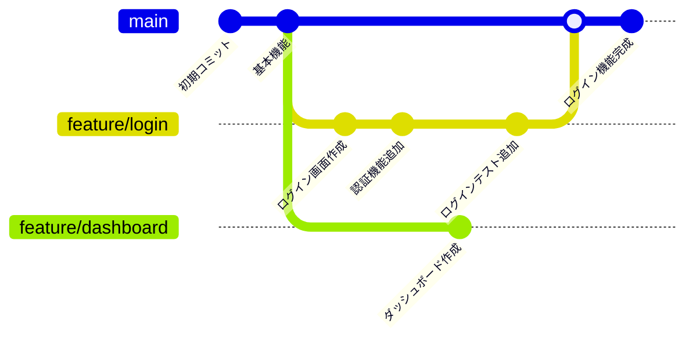

# ブランチ

ブランチは、メインの開発ラインから分岐して、独立して作業を進めるための機能です。「本の章を分けて、それぞれで別の内容を書く」ようなイメージです。

## なぜブランチを使う？

ブランチを使うことで：

- メインのコード（mainブランチ）を安全に保てる
- 複数の機能を同時に開発できる
- 実験的な変更を安全に試せる
- チーム開発で作業が競合しにくくなる

## ブランチの基本概念



上の図では、feature/loginブランチで開発を進めた後、mainブランチに「マージ」（統合）しています。マージやプルリクエスト（GitHub上でのコード統合の仕組み）については、後のセクションで詳しく解説します。

## git branch - ブランチの管理

### ブランチ一覧の確認

```bash
# ローカルブランチの一覧表示
git branch

# 出力例：
#   feature/login
# * main          （*は現在のブランチ）
#   feature/dashboard
```

### 新しいブランチの作成

```bash
# 新しいブランチを作成（まだ切り替わらない）
git branch feature/user-profile

# ブランチが作成されたか確認
git branch
```

### ブランチの削除

```bash
# ブランチを削除（マージ済みの場合）
git branch -d feature/completed-feature

# 強制削除（マージしていなくても削除）
git branch -D feature/experimental
```

## git switch - ブランチの切り替え

Git 2.23以降で推奨されている、ブランチ切り替え専用のコマンドです。

### 既存ブランチに切り替え

```bash
# 指定したブランチに切り替え
git switch main
git switch feature/login

# 切り替え後の確認
git branch
```

### 新しいブランチを作成して切り替え

```bash
# 一番よく使うパターン
git switch -c feature/new-function

# これは以下の2つのコマンドを同時に実行するのと同じ：
# git branch feature/new-function
# git switch feature/new-function
```

### 実践例

```bash
# 1. 新機能用のブランチを作成して切り替え
git switch -c feature/user-search

# 2. 現在のブランチを確認
git branch
# * feature/user-search
#   main

# 3. 作業完了後、mainブランチに戻る
git switch main
```

## git checkout - 旧方式（参考）

以前は`git checkout`がブランチ切り替えに使われていました。

```bash
# 古い方式（まだ使えるが推奨しない）
git checkout main
git checkout -b feature/old-style

# 新しい方式（推奨）
git switch main
git switch -c feature/new-style
```

::: tip なぜswitchが推奨？
`git checkout`は多機能すぎて、初心者が混乱しやすいためです：

- ブランチ切り替え
- ファイルの変更取り消し
- 特定のコミットに移動

`git switch`はブランチ切り替え専用なので、より安全で分かりやすいです。
:::

## ブランチの命名規則

チームで統一されたブランチ名を使いましょう：

### 推奨する命名パターン

```bash
# 新機能の開発
feature/機能名
feature/user-registration
feature/password-reset

# バグ修正
fix/問題の説明
fix/login-error
fix/image-display-bug

# ドキュメント更新
docs/内容
docs/api-specification
docs/setup-guide
```

### 悪い命名例

```bash
# 避けるべき例
test           # 何のテスト？
fix            # 何を修正？
branch1        # 内容が不明
my-work        # 具体性がない
```

## 実践的なブランチワークフロー

### 1. 新機能開発の場合

```bash
# 1. mainブランチに切り替え
git switch main

# 2. 最新の状態に更新
git pull origin main

# 3. 新しいブランチを作成
git switch -c feature/user-profile

# 4. 作業を進める
# ファイルを編集...
git add .
git commit -m "feat: ユーザープロフィール画面を作成"

# 5. さらに作業を続ける
# ファイルを編集...
git add .
git commit -m "feat: プロフィール編集機能を追加"

# 6. 作業完了後、GitHubにプッシュ
git push origin feature/user-profile

# 7. GitHub上でプルリクエストを作成（詳しくはGitHubセクションで説明）
# プルリクエストは、作成したブランチをmainに統合するための申請です
```

### 2. バグ修正の場合

```bash
# 1. mainから分岐
git switch main
git pull origin main
git switch -c fix/login-validation

# 2. バグを修正
git add .
git commit -m "fix: ログイン時のバリデーションエラーを修正"

# 3. プッシュしてプルリクエスト作成
git push origin fix/login-validation
# GitHub上でプルリクエストを作成し、チームメンバーにレビューを依頼
```

## よくある質問

### Q: どのブランチにいるか分からなくなった

A: `git branch`で現在のブランチを確認できます：

```bash
git branch
# * feature/user-profile  （*が現在のブランチ）
#   main
```

### Q: ブランチを切り替えたら変更が消えた？

A: 大丈夫です。各ブランチは独立しているので、元のブランチに戻れば変更は残っています：

```bash
# feature/loginで作業していた場合
git switch feature/login  # 変更が戻ってくる
```

### Q: ブランチを削除したらコミットも消える？

A: マージ済みのブランチなら安全に削除できます：

```bash
# マージ済みブランチの削除（安全）
git branch -d feature/completed

# 未マージブランチの削除警告
git branch -d feature/work-in-progress
# error: The branch 'feature/work-in-progress' is not fully merged.
```

### Q: mainブランチで直接作業してしまった

A: 状況によって対処法が異なります：

**1. まだコミットしていない場合**

```bash
# 現在の変更を新しいブランチに移動
git switch -c feature/accidental-work
git add .
git commit -m "作業内容"

# これでmainブランチには変更が残らず、新しいブランチで作業を続行できます
```

**2. すでにコミットしてしまった場合**

```bash
# 現在のコミットを含む新しいブランチを作成
git switch -c feature/accidental-work

# mainブランチに戻って、コミットを取り消す（危険な操作）
git switch main
git reset --hard HEAD~1
```

::: danger 重要
`git reset --hard`は取り返しのつかない操作です。実行前に必ずチームメンバーや詳しい人に相談することをおすすめします。間違えるとコミットが完全に失われる可能性があります。
:::

## チーム開発でのブランチ運用

### 基本的な流れ

1. **mainブランチから分岐**：新しい作業を始める時
2. **機能ブランチで開発**：独立して作業を進める
3. **プルリクエスト作成**：レビューを依頼
4. **マージ後ブランチ削除**：mainに統合したら不要なブランチを削除

### ブランチの生存期間

```bash
# 短期間のブランチ（推奨）
feature/small-fix      # 1-2日で完了
fix/urgent-bug         # 数時間で完了

# 長期間のブランチ（注意が必要）
feature/major-refactor # 1週間以上かかる場合は小さく分割を検討
```

## VSCode
