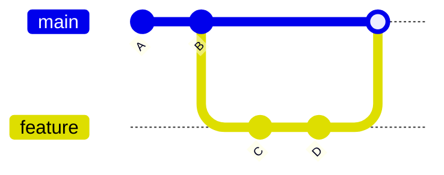
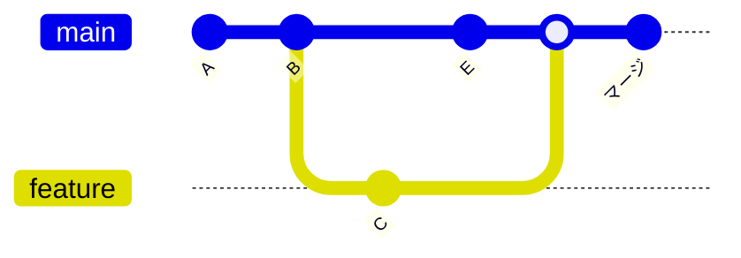
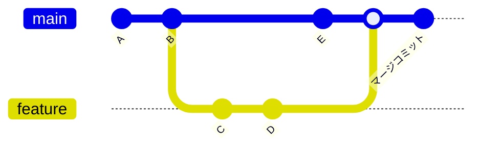
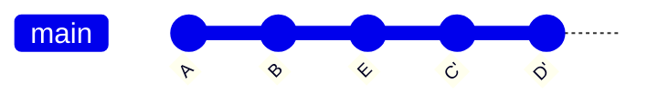

# ブランチの比較と統合

このセクションでは、ブランチ同士の違いを確認したり、統合したりする方法を学びます。少し理解が難しい内容も含まれていますが、焦らずに一つずつ理解していけば大丈夫です。実際の開発では頻繁に使う重要な機能なので、気軽に試しながら覚えていきましょう。

::: tip 学習のペース
このページの内容は段階的に学習することをおすすめします：

1. **まずは`git diff`** - 違いを確認する方法から始める
2. **次に`git merge`** - 基本的な統合方法を覚える  
3. **`git rebase`は後回し** - まずはmergeに慣れてから
4. **コンフリクト解決** - 実際に遭遇したときに詳しく学習
:::

## git diff - 変更内容の確認

`git diff`は、ファイルやブランチ間の違いを確認するためのコマンドです。「何が変わったか」を知ることで、安全にマージやその他の操作を行えます。

### 基本的な使い方

```bash
# ワーキングディレクトリとステージングエリアの違い
git diff

# ステージングエリアと最新コミットの違い
git diff --staged

# 2つのブランチの違い
git diff main feature/login

# 特定のファイルの違い
git diff main feature/login -- ファイル名.py
```

### 実践例

```bash
# 現在のブランチとmainブランチの違いを確認
git diff main

# 出力例：
# diff --git a/login.py b/login.py
# index 1234567..abcdefg 100644
# --- a/login.py
# +++ b/login.py
# @@ -10,3 +10,6 @@ def login(username, password):
#      return False
#  
# +def logout():
# +    print("ログアウトしました")
# +    return True
```

### diffの読み方

```bash
# - で始まる行：削除された内容（赤色）
- 古いコード

# + で始まる行：追加された内容（緑色）  
+ 新しいコード

# スペースで始まる行：変更されていない内容
  変更なしのコード
```

## git merge - ブランチの統合

`git merge`は、別のブランチの変更を現在のブランチに統合するコマンドです。

### 基本的な使い方

```bash
# 現在のブランチに指定したブランチの変更を統合
git merge ブランチ名
```

### 実践例

```bash
# 1. mainブランチに移動
git switch main

# 2. 最新の状態を確認
git status
git log --oneline -5

# 3. feature/loginブランチをマージ
git merge feature/login

# 4. マージ結果の確認
git log --oneline -10
```

### マージの種類

#### Fast-forward マージ

mainブランチに新しいコミットがない場合、シンプルに統合されます。



#### 3-way マージ

両方のブランチに新しいコミットがある場合、マージコミットが作成されます。



## git rebase - 履歴を整理する統合（上級編）

`git rebase`は、ブランチの履歴を「書き換えて」統合する方法です。マージよりも複雑ですが、きれいな履歴を作れます。

::: danger 初心者は後回しでOK
rebaseは上級テクニックです。最初は`git merge`に慣れることを強くおすすめします。rebaseは間違えると履歴が複雑になり、初心者には復旧が困難な場合があります。チーム開発に慣れてから学習しましょう。
:::

### 基本的な使い方

```bash
# 現在のブランチをmainブランチの最新状態を基準に書き換え
git rebase main
```

### mergeとrebaseの違い

ここでは、`feature`ブランチの変更を`main`ブランチに取り込む場合を例に説明します。

**前提条件：**

- `main`ブランチから`feature`ブランチを作成
- `feature`ブランチで作業（コミットC、D）
- その間に`main`ブランチも更新された（コミットE）
- 今、`feature`ブランチの変更を`main`に取り込みたい

**merge の場合：**

```bash
# mainブランチに移動して、featureブランチをマージ
git switch main
git merge feature
```



結果：履歴が分岐と統合の流れを保持する

**rebase の場合：**

```bash
# featureブランチでrebaseを実行
git switch feature
git rebase main
# その後、mainにマージ
git switch main
git merge feature
```



結果：`feature`ブランチのコミット（C、D）が`main`の最新（E）の後に移動し、一直線の履歴になる

### いつどちらを使う？

**merge を使う場合：**

- 安全で確実
- 履歴の流れが分かりやすい
- チーム開発では基本的にこちら

**rebase を使う場合：**

- きれいな一直線の履歴にしたい
- 個人の作業ブランチを整理したい
- まだプッシュしていないコミット

## コンフリクト（競合）の解決

同じファイルの同じ部分を異なる内容で変更した場合、コンフリクトが発生します。

### コンフリクトが発生する例

```bash
# mainブランチでファイルを編集
git switch main
# main.py を編集してユーザー表示機能を追加
git add main.py
git commit -m "feat: ユーザー表示機能を追加"

# feature ブランチでも同じファイルの同じ部分を編集
git switch feature/user-greeting
# main.py の同じ部分に挨拶機能を追加
git add main.py
git commit -m "feat: ユーザー挨拶機能を追加"

# マージを試行
git switch main
git merge feature/user-greeting
# Auto-merging main.py
# CONFLICT (content): Merge conflict in main.py
```

### コンフリクトファイルの確認

コンフリクトが発生すると、ファイルにマーカーが追加されます：

```python
def user_function():
<<<<<<< HEAD
    print("mainブランチの変更：ユーザー情報を表示します")
    return "user_info"
=======
    print("featureブランチの変更：こんにちは、ユーザーさん！")
    return "greeting"
>>>>>>> feature/user-greeting
```

### コンフリクト解決の手順

1. **コンフリクトファイルを開く**

```bash
# どのファイルでコンフリクトが発生したか確認
git status
# On branch main
# You have unmerged paths.
#   (fix conflicts and run "git commit")
# 
# Unmerged paths:
#   (use "git add <file>..." to mark resolution)
#         both modified:   main.py
```

2. **ファイルを編集してマーカーを削除**

```python
def user_function():
    # 両方の機能を統合して解決
    print("ユーザー情報を表示します")
    print("こんにちは、ユーザーさん！") 
    return "user_info_with_greeting"
```

3. **解決をGitに伝える**

```bash
# 修正したファイルをステージング
git add main.py

# コンフリクト解決を完了
git commit -m "コンフリクトを解決: ユーザー表示と挨拶機能を統合"
```

### コンフリクト解決のコツ

```bash
# 1. 慌てない - 元に戻すことも可能
git merge --abort  # マージを中止

# 2. どちらの変更も確認
git show HEAD      # 現在のブランチの変更
git show feature/test  # マージしようとしているブランチの変更

# 3. チームメンバーと相談
# どちらの変更を採用するか、または両方を統合するか相談
```

## 実践的なワークフロー

### 1. 安全なマージ手順

```bash
# 1. 作業前に状況確認
git status
git switch main
git pull origin main

# 2. マージ前に違いを確認
git diff main feature/new-function

# 3. 問題なければマージ
git merge feature/new-function

# 4. マージ結果を確認
git log --oneline -10
```

### 2. コンフリクトを避けるコツ

```bash
# 定期的にmainブランチの変更を取り込む
git switch feature/my-work
git merge main  # または git rebase main

# 作業前に最新状態にする
git switch main
git pull origin main
git switch feature/my-work
git merge main
```

## よくある質問

### Q: diffの出力が長すぎて読めない

A: オプションを使って見やすくしましょう：

```bash
# ファイル名だけ表示
git diff --name-only main feature/branch

# 統計情報を表示
git diff --stat main feature/branch

# 特定のファイルのみ
git diff main feature/branch -- src/main.py
```

### Q: マージを間違えた

A: 直前のマージなら取り消し可能です：

```bash
# 直前のマージを取り消し
git reset --hard HEAD~1

# または
git reset --merge
```

### Q: rebaseで失敗した

A: 中断して元に戻せます：

```bash
# rebase を中断
git rebase --abort
```

### Q: コンフリクトが怖い

A: まずは簡単な練習をしてみましょう：

```bash
# テスト用のブランチで練習
git switch -c test-merge
# 意図的にコンフリクトを作って解決の練習
```

## チーム開発でのベストプラクティス

### マージ前の確認事項

1. **差分の確認**

```bash
git diff main feature/my-work
```

2. **テストの実行**

```bash
# プロジェクトのテストコマンドを実行
npm test  # または pytest など
```

3. **コードの確認**

```bash
# 自分の変更を再確認
git log --oneline main..feature/my-work
```

### 安全な作業の進め方

- 小さな単位でコミット
- 定期的にmainブランチの変更を取り込む
- マージ前に必ずdiffで確認
- 不安な時はチームメンバーに相談

コンフリクトやマージは最初は難しく感じますが、慣れれば日常的な操作になります。失敗を恐れずに、練習環境で色々試してみることが上達の近道です。

## VSCode
