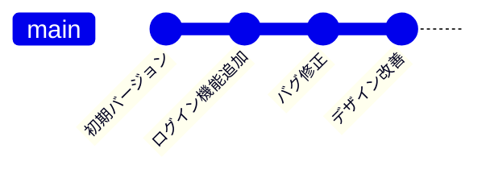
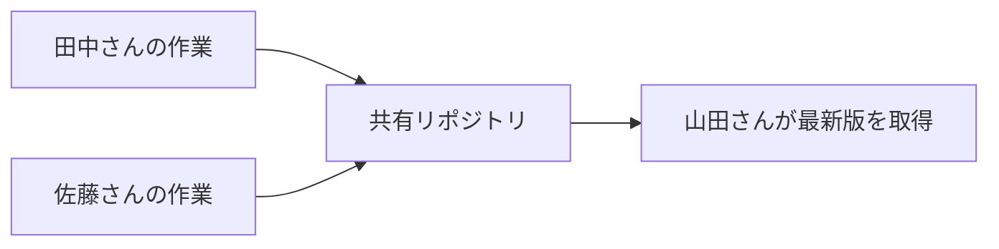
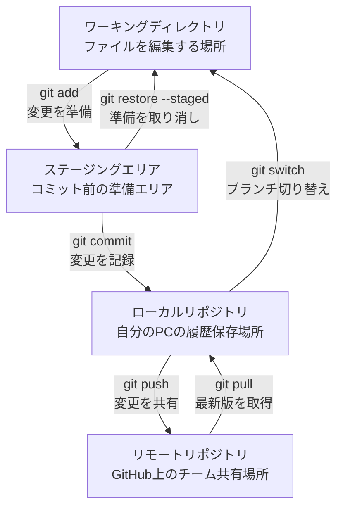

# Gitの基礎

プログラミングを始めたばかりの方にとって、Gitは少し難しく感じるかもしれません。でも大丈夫です。このページでは、Gitとは何か、なぜ必要なのかを分かりやすく説明します。

## Gitとは何か？

Gitは**バージョン管理システム**と呼ばれるツールです。簡単に言うと、「ファイルの変更履歴を記録・管理してくれるツール」です。

### 身近な例で考えてみましょう

レポートを書いているとき、こんな経験はありませんか？

```
レポート.docx
レポート_修正版.docx
レポート_最終版.docx
レポート_最終版_修正.docx
レポート_本当の最終版.docx
```

これは手動でのバージョン管理です。Gitを使えば、このような作業を自動化し、より便利に管理できます。

## なぜGitが必要なのか？

### 1. 変更履歴の管理



Gitは「いつ、誰が、何を変更したか」をすべて記録します。

### 2. 安全な実験

新しい機能を試したいとき：

- 元のコードを壊す心配がない
- 失敗しても簡単に元に戻せる
- 複数のアイデアを同時に試せる

### 3. チーム開発での協力



複数人で同じプロジェクトを開発するとき、お互いの変更を安全に統合できます。

## Gitの4つの重要な領域

Gitでは、ファイルが4つの異なる「場所」を移動します。これを理解することが、Git習得の鍵です。



### 1. ワーキングディレクトリ（作業場所）

- 実際にファイルを編集する場所
- VS Codeでコードを書いている場所
- **例**: `main.py`ファイルを編集中

### 2. ステージングエリア（準備場所）

- コミット前の「準備エリア」
- 「このファイルを記録に残したい」と選択したファイルが置かれる場所
- **例**: `git add main.py`で準備完了

### 3. ローカルリポジトリ（記録場所）

- 自分のPC内にある変更履歴の保存場所
- `git commit`で正式に記録される
- **例**: 「ログイン機能を追加」という履歴が保存

### 4. リモートリポジトリ（共有場所）

- GitHub上にある、チーム全体で共有する場所
- `git push`で自分の変更をチームに共有
- **例**: チームメンバーが最新版を取得できる

## 基本的なワークフロー

日常的な作業の流れを見てみましょう：

```bash
# 1. 現在の状況を確認
git status

# 2. ファイルを編集
# VS Code等でコードを編集

# 3. 変更をステージング（準備）
git add ファイル名.py

# 4. 変更をコミット（記録）
git commit -m "何を変更したかの説明"

# 5. 変更を共有（チーム開発の場合）
git push origin ブランチ名
```

## 重要な概念

### コミット（Commit）

- 変更の「記録」を作ること
- 写真を撮るようなイメージ
- 後から「この時点に戻りたい」と思ったときの目印

### ブランチ（Branch）

- 開発の「流れ」を分岐させること
- 新機能開発やバグ修正を安全に行うため
- メインの開発ラインを壊さずに作業できる

### マージ（Merge）

- 分岐した開発ラインを統合すること
- 完成した機能をメインラインに取り込む

## 初心者がよく感じる不安

### 「間違えたらどうしよう」

→ Gitは「元に戻す」機能が豊富です。間違いを恐れずに試してみましょう。

### 「コマンドが覚えられない」

→ 最初は基本的なコマンドだけで十分です。徐々に覚えていけば大丈夫。

### 「チームに迷惑をかけそう」

→ 適切なワークフローを覚えれば、むしろチーム開発が楽になります。

## このハンドブックでの学習の流れ

以下の順序で学習することをおすすめします：

### 基礎編（必須）

1. **ステージング** - ファイルの変更を準備する方法
2. **コミット** - 変更を記録する方法  
3. **ブランチ** - 安全に作業を分岐する方法

### 実践編（チーム開発で必要）

4. **リモート** - チームメンバーと変更を共有する方法
5. **GitHub** - プルリクエストによるコードレビュー

### 応用編（慣れてから学習）

6. **ブランチの比較と統合** - 異なるブランチを統合する高度な方法
7. **トラブルシューティング** - 問題が起きたときの対処法

::: tip 学習のコツ
最初は基礎編だけで十分です。実際のプロジェクトで基本操作に慣れてから、応用編に進むことをおすすめします。
:::

## まとめ

Gitは最初は複雑に見えますが、基本的な概念を理解すれば、プログラミングにおいて非常に強力なツールになります。

**覚えておいてほしいこと：**

- Gitは「変更履歴の管理ツール」
- 4つの領域（ワーキングディレクトリ、ステージング、ローカル、リモート）を理解する
- 間違いを恐れずに、実際に使いながら覚える
- チーム開発では必須のツール

次のページから、実際のコマンドを使いながら、一歩ずつ学んでいきましょう！
