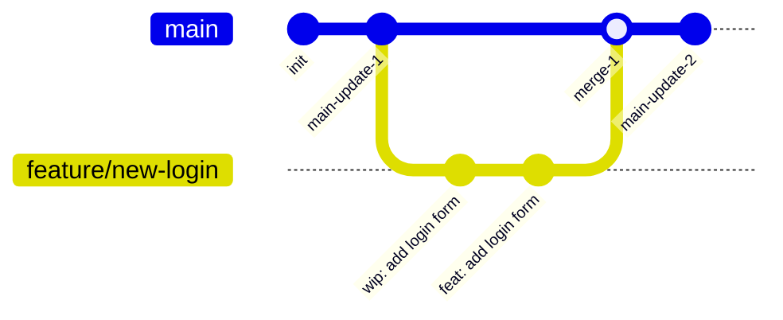

# Git & GitHub

このセクションでは、ソースコードのバージョン管理ツールであるGitと、チームでコードを共有するためのプラットフォームであるGitHubの基本的な使い方を学びます。

## なぜGitを使うのか？

複数人で同じファイルを編集すると、「誰がどこを直したか分からなくなる」「間違って他の人の修正を消してしまった」といった問題が起こりがちです。

Gitを使うことで、変更の履歴を正確に記録し、いつでも過去の状態に戻したり、他の人の作業と安全に統合したりすることができます。

## 基本的な開発フロー

私たちのチームでは、`main`ブランチを常に安定した状態に保ち、そこから個別の作業ブランチを作成して開発を進める、というシンプルなフローを採用します。

この図は、`main`ブランチから`feature/new-login`というブランチが作成され、作業が進んだ後、再び`main`ブランチに統合（マージ）される様子を表しています。

次のページから、このフローを実現するための各コマンド（`add`, `commit`, `branch`など）について、一つずつ詳しく見ていきましょう。
