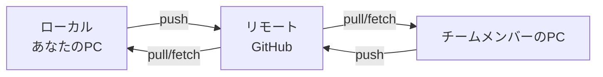

# リモート連携

リモートリポジトリは、GitHub上にある「チームで共有するファイル置き場」です。自分のPC（ローカル）で作業した内容を、チームメンバーと共有するために使います。

## リモートとローカルの関係



## git fetch - 情報だけを取得

`git fetch`は、「リモートで何が変わったか確認する」ためのコマンドです。ファイルは変更せず、情報だけを取得します。

```bash
# リモートの最新情報を取得
git fetch origin
```

### いつ使う？

```bash
# 他の人が何をしたか確認したい時
git fetch origin
git log --oneline origin/main  # リモートのmainブランチのコミット履歴を確認

# 自分の作業と他の人の作業を比較したい時
git diff origin/main  # リモートのmainと現在の差分を確認
```

## git pull - 取得して統合

`git pull`は、「リモートの変更を取得して、自分の作業に統合する」コマンドです。

```bash
# 基本的な使い方
git pull origin main
```

### 内部的な動作

`git pull`は実際には2つのコマンドを組み合わせています：

```bash
# git pullは以下と同じ
git fetch origin main  # リモートの変更を取得
git merge origin/main  # ローカルのブランチに統合
```

### 実践例

```bash
# 1. 作業開始前にリモートの最新状態を取得
git switch main
git pull origin main

# 2. 新しいブランチで作業
git switch -c feature/new-function
# 作業...
git add .
git commit -m "feat: 新機能を追加"

# 3. プッシュ前に再度最新状態を確認
git switch main
git pull origin main  # 他の人の変更があるかチェック
git switch feature/new-function
```

## git push - ローカルの変更をアップロード

`git push`は、自分の変更をリモートにアップロードするコマンドです。

```bash
# 基本的な使い方
git push origin ブランチ名
```

### 実践例

```bash
# 1. 作業完了後、ブランチをプッシュ
git push origin feature/user-profile

# 2. 初回プッシュ時（追跡設定も同時に行う）
git push -u origin feature/user-profile

# 3. 2回目以降は簡単に
git push  # 追跡設定済みなら省略可能
```

### プッシュが拒否される場合

```bash
# エラー例
! [rejected]        main -> main (non-fast-forward)
error: failed to push some refs to 'github.com:username/repo.git'
```

**原因**：リモートに自分にない変更がある

**解決方法**：
```bash
# 1. まずリモートの変更を取得
git pull origin main

# 2. コンフリクトがあれば解決
# （コンフリクト解決については troubleshooting.md を参照）

# 3. 再度プッシュ
git push origin main
```

## fetch、pull、pushの使い分け

### git fetch
- **使用場面**：リモートの状況を確認したい時
- **影響**：ローカルファイルは変更されない
- **例**：「誰かが何かプッシュしたみたいだけど、何だろう？」

### git pull
- **使用場面**：リモートの変更を自分の作業に取り込みたい時
- **影響**：ローカルファイルが更新される
- **例**：「作業開始前に最新状態にしよう」

### git push
- **使用場面**：自分の変更をチームに共有したい時
- **影響**：リモートリポジトリが更新される
- **例**：「機能が完成したからみんなに見せよう」

## 実践的なワークフロー

### 1. 作業開始時

```bash
# mainブランチを最新にする
git switch main
git pull origin main

# 新しいブランチで作業開始
git switch -c feature/new-work
```

### 2. 作業中

```bash
# 定期的にコミット
git add .
git commit -m "feat: 機能Aを実装"

# さらに作業...
git add .
git commit -m "feat: 機能Aにテストを追加"
```

### 3. 作業完了時

```bash
# リモートにプッシュ
git push origin feature/new-work

# GitHub上でプルリクエストを作成
# （次のセクションで詳しく説明）
```

## よくある質問

### Q: pullとfetchの違いがわからない

A: 簡単に言うと：
- `fetch`：「確認だけ」
- `pull`：「確認して統合」

```bash
# 安全に確認したい場合
git fetch origin
git log origin/main  # 何が変わったか確認
git pull origin main  # 問題なければ統合

# 一気に統合したい場合
git pull origin main  # 取得と統合を同時実行
```

### Q: pushが失敗する

A: よくある原因と対処法：

1. **リモートに新しい変更がある**
```bash
git pull origin main  # まず最新を取得
git push origin main  # 再度プッシュ
```

2. **ブランチ名が間違っている**
```bash
git branch  # 現在のブランチを確認
git push origin 正しいブランチ名
```

3. **SSH認証の問題**
```bash
ssh -T git@github.com  # 接続確認
# 設定については setup.md を参照
```

### Q: pullでコンフリクトが発生

A: コンフリクト解決の手順：
```bash
# pullでコンフリクト発生
git pull origin main
# Auto-merging file.py
# CONFLICT (content): Merge conflict in file.py

# ファイルを開いてコンフリクトマーカーを確認・修正
# <<<<<<< HEAD から >>>>>>> の部分を編集

# 解決後にコミット
git add file.py
git commit -m "コンフリクトを解決"
```

### Q: 間違えてmainブランチにプッシュしてしまった

A: すぐにチームに連絡して、以下を検討：
```bash
# 1. 直前のコミットなら取り消し可能（危険）
git reset --hard HEAD~1
git push --force origin main  # 強制プッシュ（チーム確認必須）

# 2. 新しいコミットで修正（安全）
git revert HEAD  # 取り消しコミットを作成
git push origin main
```

## チーム開発でのベストプラクティス

### 作業開始前

```bash
# 必ず最新状態にしてから作業開始
git switch main
git pull origin main
git switch -c feature/new-work
```

### 作業中

```bash
# 定期的にリモートの変更をチェック
git fetch origin
git log --oneline origin/main  # 他の人の作業を確認
```

### 作業完了時

```bash
# プッシュ前に最新状態と統合
git switch main
git pull origin main
git switch feature/new-work
git merge main  # または git rebase main
git push origin feature/new-work
```

## VSCode