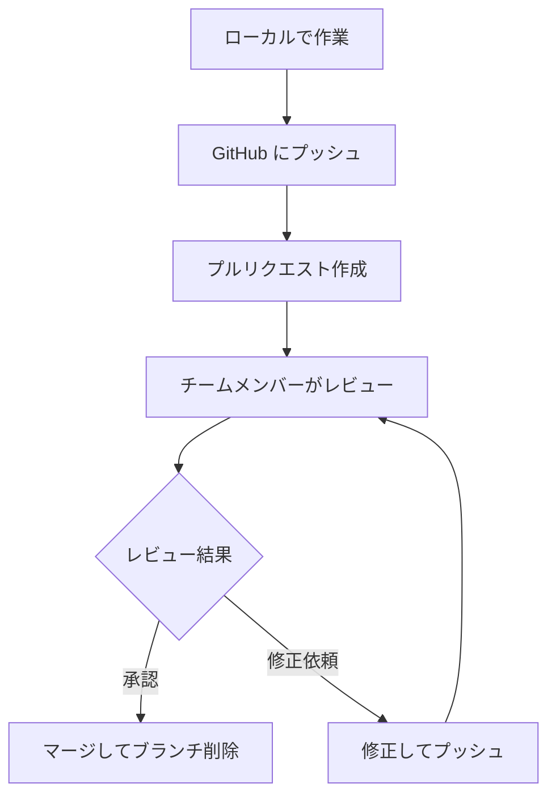

# GitHub

GitHubは、Gitで管理されたプロジェクトをオンラインで共有・協力開発するためのプラットフォームです。チーム開発では欠かせないツールで、世界中の開発者が利用しています。

## GitHubとは

GitHubは以下の機能を提供します：

- **リモートリポジトリ** - コードをオンラインで保存・共有
- **プルリクエスト** - コードレビューと安全な統合
- **Issue管理** - バグ報告や機能要求の管理
- **プロジェクト管理** - タスクの進捗管理

## プルリクエスト（Pull Request）

プルリクエスト（PR）は、チーム開発で最も重要な機能の一つです。「自分の変更をメインブランチに統合してください」という申請のことです。

### プルリクエストの流れ



### 1. ブランチでの作業

```bash
# 1. mainブランチから最新版を取得
git switch main
git pull origin main

# 2. 新しいブランチを作成
git switch -c feature/user-profile

# 3. 作業を進める
# ファイルを編集...
git add .
git commit -m "feat: ユーザープロフィール画面を追加"

# 4. さらに作業を続ける
# ファイルを編集...
git add .
git commit -m "feat: プロフィール編集機能を追加"
```

### 2. GitHub にプッシュ

```bash
# ブランチをGitHubにアップロード
git push origin feature/user-profile
```

プッシュすると、GitHub上に「プルリクエストを作成」ボタンが表示されます。

### 3. プルリクエスト作成

GitHub上で以下の項目を入力します：

#### タイトル

```bash
feat: ユーザープロフィール機能を追加
```

#### 説明文の例

```markdown
## 概要
ユーザーがプロフィール情報を表示・編集できる機能を追加しました。

## 変更内容
- プロフィール表示画面の作成
- プロフィール編集機能の実装
- バリデーション機能の追加

## 確認事項
- [ ] プロフィール表示が正しく動作する
- [ ] 編集機能が正しく動作する
- [ ] バリデーションエラーが適切に表示される

## スクリーンショット
（画面キャプチャがあれば添付）
```

### 4. コードレビュー

チームメンバーがコードを確認し、以下のようなフィードバックをします：

#### 良い例のコメント

```txt
この実装はとても分かりやすいですね！
ただ、L23でエラーハンドリングを追加していただけますか？
```

#### 修正依頼の例

```txt
この部分は関数に分割した方が読みやすくなりそうです。
参考: https://example.com/best-practices
```

### 5. 修正とプッシュ

レビューで指摘された箇所を修正：

```bash
# 修正作業
# ファイルを編集...

# 修正をコミット
git add .
git commit -m "fix: エラーハンドリングを追加"

# 同じブランチにプッシュ（プルリクエストが自動更新される）
git push origin feature/user-profile
```

### 6. マージとクリーンアップ

レビューが承認されたら：

1. **GitHub上でマージ**
   - "Merge pull request" ボタンをクリック
   - マージ後にブランチを削除

2. **ローカルの整理**

```bash
# mainブランチに切り替え
git switch main

# 最新版を取得
git pull origin main

# 不要になったブランチを削除
git branch -d feature/user-profile
```

## プルリクエストのベストプラクティス

### 良いプルリクエストの特徴

1. **適切なサイズ**
   - 1つのプルリクエストで1つの機能
   - レビューしやすい分量（通常300行以下）

2. **分かりやすいタイトル**

   ```bash
   # 良い例
   feat: ユーザー検索機能を追加
   fix: ログイン時のバリデーションエラーを修正
   
   # 悪い例
   更新
   修正
   いろいろ変更
   ```

3. **詳細な説明**
   - 何を変更したか
   - なぜ変更したか
   - どうやって確認すればよいか

### レビューを依頼する前のチェックリスト

- [ ] コードが正しく動作することを確認
- [ ] テストが通ることを確認
- [ ] コミットメッセージが適切
- [ ] 不要なファイルが含まれていない
- [ ] プルリクエストの説明が分かりやすい

## GitHub上でのコラボレーション

### Issue（課題管理）

バグ報告や機能要求を管理：

```markdown
# Issue の例
## バグ報告
**現象**
ログイン画面でパスワードを間違えてもエラーメッセージが表示されない

**再現手順**
1. ログイン画面を開く
2. 正しくないパスワードを入力
3. ログインボタンをクリック

**期待される動作**
「パスワードが間違っています」というメッセージが表示される
```

### Project（プロジェクト管理）

タスクの進捗を管理：

- To Do（未着手）
- In Progress（作業中）  
- Done（完了）

## よくある質問

### Q: プルリクエストが拒否された

A: 以下を確認しましょう：

- フィードバックに対応したか
- テストが通っているか
- コンフリクトが発生していないか

### Q: レビューが来ない

A: 以下を試してみましょう：

- レビュアーを明示的に指名する
- チャットやメールで依頼する
- プルリクエストの説明を詳しくする

### Q: マージ後にバグが見つかった

A: 慌てずに対応しましょう：

```bash
# 緊急修正用のブランチを作成
git switch main
git pull origin main
git switch -c hotfix/login-bug

# 修正してプルリクエスト作成
```

## チーム開発でのルール例

各チームで以下のようなルールを決めることが多いです：

### プルリクエストルール

- 最低1人のレビュー承認が必要
- CI/CDテストが通過していること
- マージ後は必ずブランチを削除

### ブランチ命名規則

```bash
feature/機能名    # 新機能
fix/修正内容      # バグ修正  
hotfix/緊急修正   # 緊急修正
docs/文書名       # ドキュメント更新
```

### コミットメッセージ規約

Conventional Commitsを使用（詳細はコミットのページを参照）

## まとめ

プルリクエストは最初は複雑に感じますが、チーム開発では非常に重要な仕組みです。

**重要なポイント：**

- プルリクエストはコードレビューのための仕組み
- 小さく、理解しやすい変更に分割する
- 丁寧な説明とコミットメッセージを心がける
- フィードバックを恐れず、学習の機会として捉える

実際のプロジェクトで経験を積むことで、自然に慣れていきます。最初は緊張するかもしれませんが、チームメンバーと協力しながら進めていきましょう！
